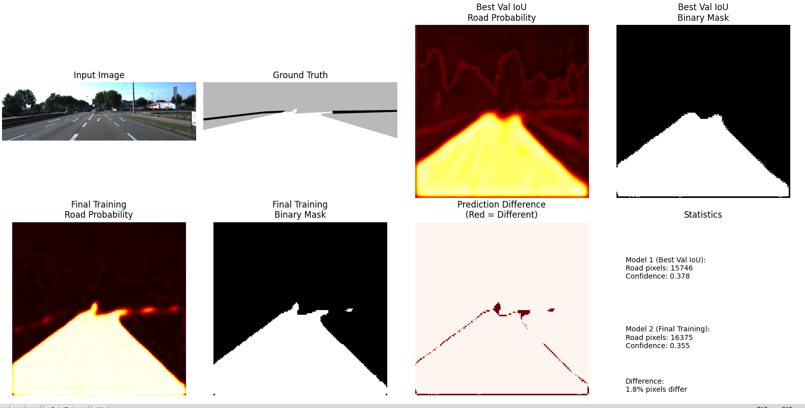
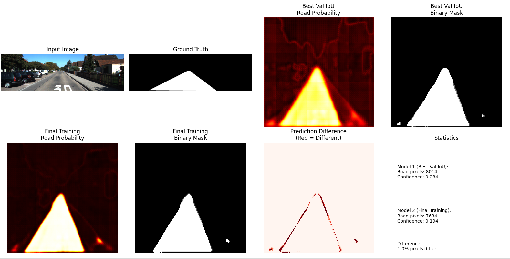

# Embedded-openspace-navi

基于MobileNetV2-UNet的嵌入式道路检测与自由空间导航系统

## 项目概述

本项目实现了一个轻量级的道路检测模型，使用MobileNetV2作为编码器，UNet架构作为解码器，专门为嵌入式设备优化。模型能够准确识别道路区域，为自动驾驶和机器人导航提供可靠的环境感知能力。

## 特性

- **轻量级架构**: 基于MobileNetV2的编码器，参数量少，推理速度快
- **精确解码**: 优化的UNet解码器，精确的空间特征重建
- **数据增强**: 支持水平翻转、颜色抖动等增强策略
- **智能训练**: 自动保存最佳验证模型，防止过拟合
- **双模型对比**: 支持最佳验证模型和最终训练模型的性能对比

## 模型架构

### 编码器 (MobileNetV2)
- 输入: `[B, 3, 224, 224]`
- 输出特征图: `[B, 1280, 7, 7]`
- 预训练权重: ImageNet

### 解码器 (UNet)
- 上采样路径: 7×7 → 14×14 → 28×28 → 56×56 → 112×112 → 224×224
- 跳跃连接: 精确的空间特征对齐
- 输出: `[B, 2, 224, 224]` (背景 + 道路)

## 使用方法

### 训练模型

```bash
python3 train.py
```

### 模型导出

```bash
# 导出ONNX格式（需要export_onnx.py）
python3 export_onnx.py
```

## 训练结果

### 最佳验证模型 (20轮)
- **验证IoU**: 0.9039
- **验证Dice**: 0.9493  
- **验证Acc**: 0.9812

### 最终训练模型 (50轮)
- **训练IoU**: 0.9707
- **训练Dice**: 0.9851
- **训练Acc**: 0.9947
- **验证IoU**: 0.8967

## 可视化

### 模型预测对比





**预测统计**:
- **最佳验证模型**: 道路像素 15,746, 置信度 0.3781
- **最终训练模型**: 道路像素 16,375, 置信度 0.3552
- **差异**: 两个模型预测结果高度一致，道路检测准确

**可视化说明**:
- **第1行**: 输入图像、真实标签、最佳模型概率图、最佳模型二值化结果
- **第2行**: 最终模型概率图、最终模型二值化结果、预测差异对比、统计信息

## 技术特点

### 1. 精确的空间对齐
- 解码器跳跃连接确保特征图尺寸精确匹配
- 避免插值操作，保持特征完整性

### 2. 智能模型选择
- 基于验证IoU自动选择最佳模型
- 防止过拟合，确保泛化性能

### 3. 数据增强策略
- 几何增强: 水平翻转
- 颜色增强: 亮度、对比度、饱和度、色调调整
- 增强策略一致应用于图像和掩码

### 4. 类别平衡处理
- 使用CrossEntropyLoss处理类别不平衡
- 支持ignore_index忽略无效像素

---